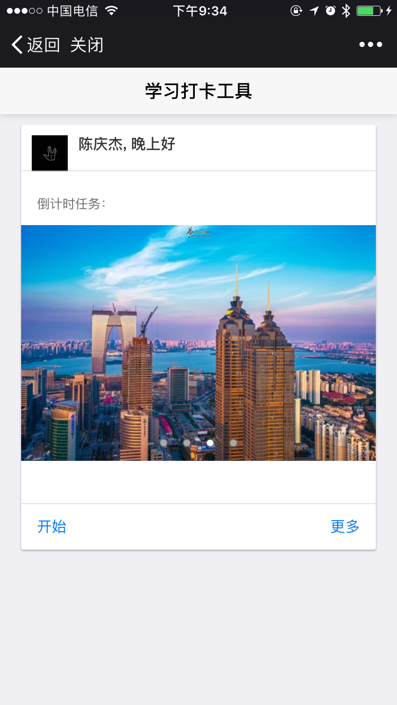
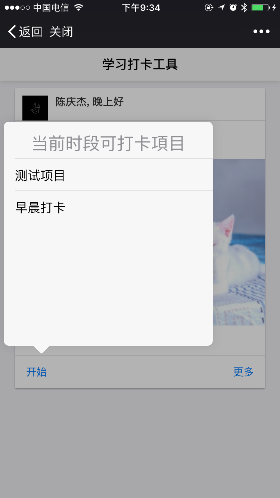
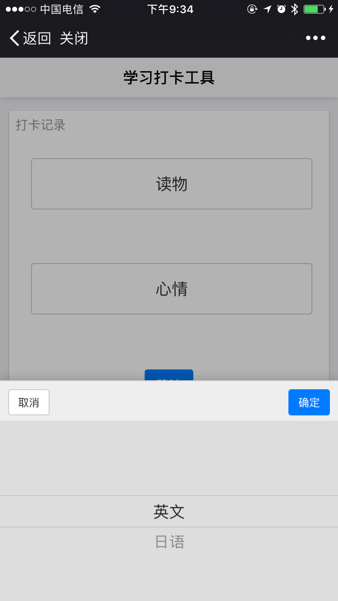
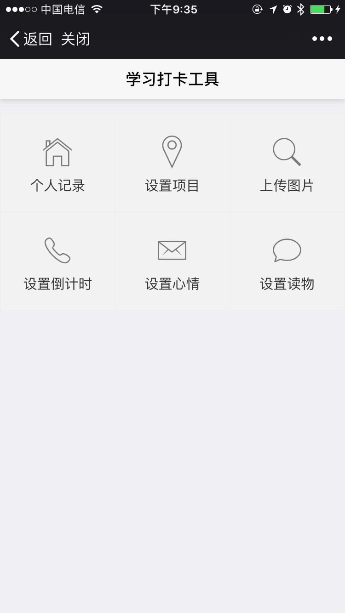
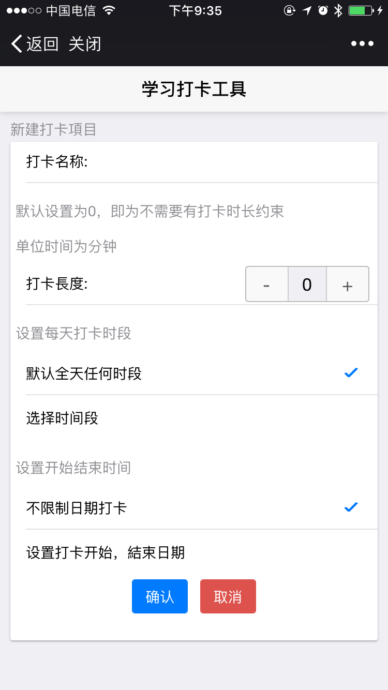
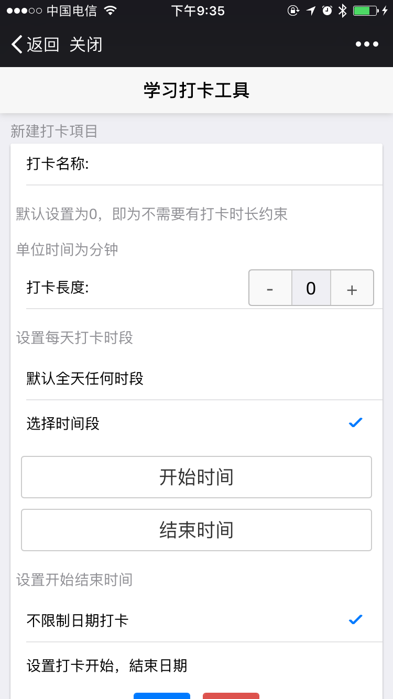
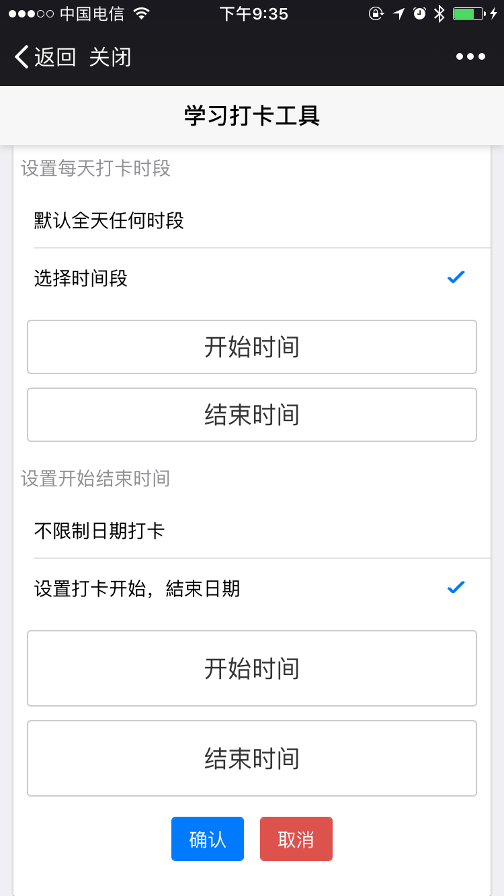
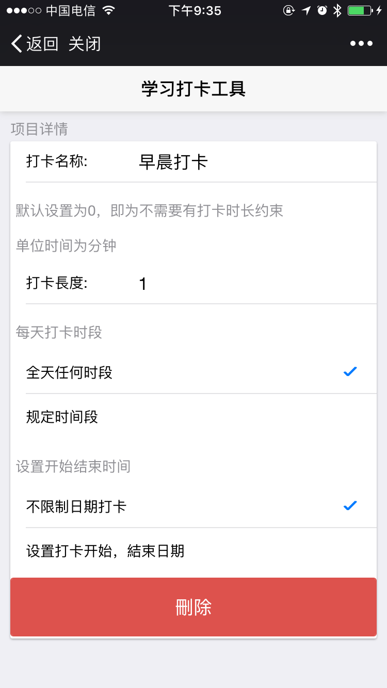
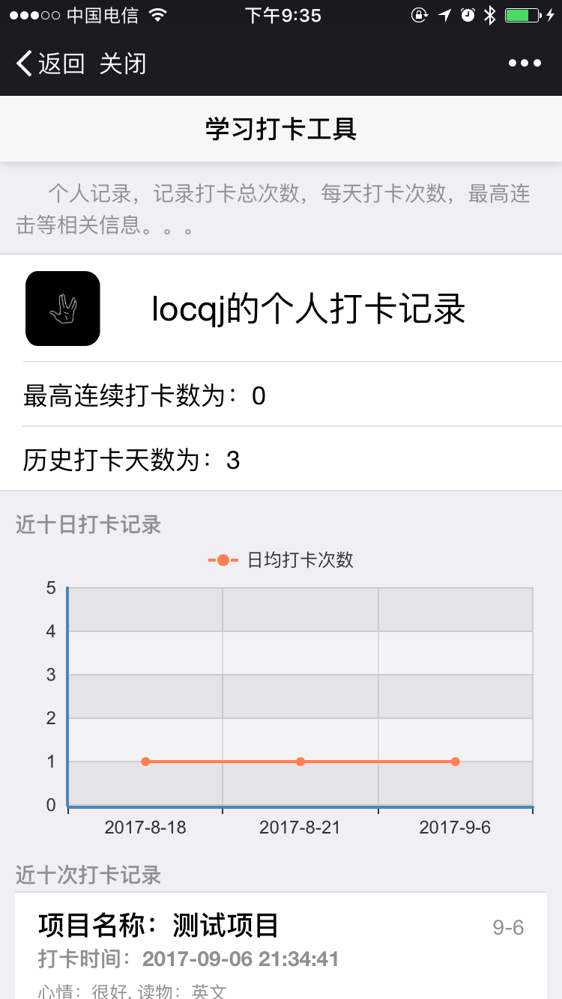

# signin_system

## 用戶需求
1. 指定时间打卡，滿足在一定時間范围內，才能开始打卡
2. 历史打卡记录统计，可视化展示
3. 个人打卡记录，记录最长打卡时间，最近十次打卡详情
4. 定時微信消息推送提醒任務，系統可配置
5. 用户达成成就，管理員可以收到邮件提示（或短信）
6. 打卡成功选填心情（一般，不錯， 很棒）,心情和读物都可以自定义, 标签选填读物类型，选填好心情，读物打卡成功
7. 倒计时记录，做成可配置的

## 环境需求
* php 7.0.1
* mysql 5.6.*
* composer 1.4.2

## 目录结构

### 总体结构

```
├── code 代码
├── db 数据库历史版本
└── docs 文档，数据库设计图
```
### 预览
* 注册测试号，配置安全域名

* 项目首页
 
* 点击打卡，如果项目有时间限制，会显示当前时段所属项目
 
* 打卡活动页，如果项目设置有打卡时间，倒计时完后才能调到打卡记录
 
* 打卡完毕，记录打卡详情

 
* 项目首页点击更多，用户自定义操作
 
* 新建打卡项目


 
* 查看打卡项目
 
* 打卡个人记录


## 项目部署
1. git clone https://github.com/locqj/signin_system.git
2. cd signin_system/code/signin_system
3. cp .env.example .env
4. php artisan key:generate 生成laravel key
5. 打开.env配置相应数据库信息
6. composer install
7. npm（cnpm， yarm） install
8. chmod -R 755 stroage bootstrap
9. cd ../db mysql -u xxx -p dbname < xxx.sql
10. php artisan storage:link(实际上就是 ln -s /home/wwwroot/default/xxx/code/signin_system/storage/app/pulic /home/wwwroot/default/xxx/code/signin_system/public/storage ) 软链接 
11. php artisan servesan serve